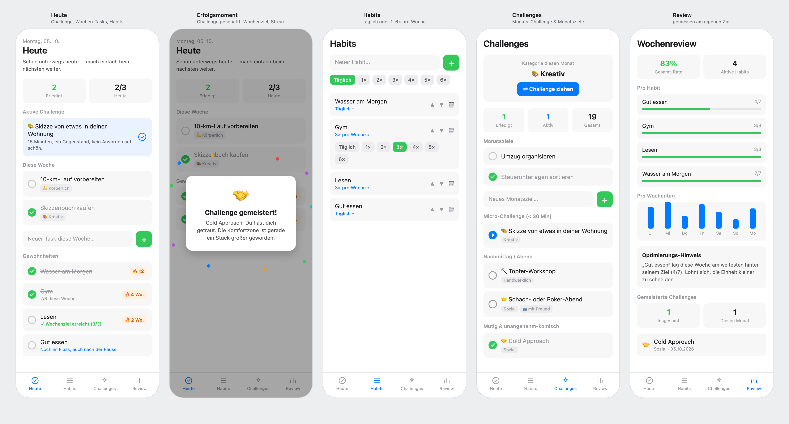

# LifeDirector

**A growth app, not just a habit tracker.** LifeDirector helps you keep your everyday habits on track *and* regularly pushes you a little outside your comfort zone. It works on three time horizons:

- **Daily: habits.** Things you want to do regularly. That can be every day ("Wasser am Morgen") or a few times a week ("Gym, 3× pro Woche"). Hitting your own target counts as success, so you don't need a perfect 7/7.
- **Weekly: tasks.** One-off things for this week, each tagged with a category (physical, creative, social, hands-on).
- **Monthly: challenges and goals.** Each month the app suggests a category, and you draw a random challenge from it ("Töpfer-Workshop", "Cold Approach"). You can also set free-form monthly goals ("Umzug organisieren").

The app rewards progress instead of demanding perfection. One missed day doesn't wipe out your progress, because a soft *momentum* score carries you through. Milestones, reached weekly targets and completed challenges are celebrated with confetti and a short message about who you're becoming, rather than a generic "good job". Reminder notifications encourage you instead of nagging you.

There's no sign-up. You open the app and start right away.

The app interface is in German.

## What it looks like



*Mockup with sample data. The source is [`docs/mockup.html`](docs/mockup.html), and the command to re-render the image is in its header comment.*

| Screen | What you do there |
|---|---|
| **Heute** | Tick off today's habits, see your active challenge and this week's tasks. Weekly-target habits show their progress ("2/3 diese Woche") and streaks are counted in days or weeks. |
| **Habits** | Add, reorder and remove habits, and set each one to *Täglich* or 1–6× per week. |
| **Challenges** | Draw a challenge from this month's category, track its status (open → active → done) and manage monthly goals. |
| **Review** | See the last 7 days, measured against your own targets. It includes a per-habit and per-weekday breakdown, an optimization hint and a list of every challenge you've completed. |

Where the app is heading (accounts, dreams and life goals, more) is in [ROADMAP.md](ROADMAP.md).

---

## Tech stack

- [Expo](https://docs.expo.dev/versions/v57.0.0/) SDK 57 with React Native and Expo Router (tabs in `app/(tabs)/`)
- [Supabase](https://supabase.com) for data (Postgres with row-level security) and anonymous auth
- `react-native-reanimated` for the celebration animation, `expo-notifications` for the daily reminder

| Path | Contents |
|---|---|
| `app/` | Screens: `(tabs)/index.tsx` (Heute), `habits.tsx`, `challenges.tsx`, `review.tsx`. `_layout.tsx` creates or restores the session before showing any screen |
| `lib/` | Supabase client and session (`supabase.ts`), streak, momentum and motivational texts (`motivation.ts`), habit frequency helpers (`habits.ts`), challenge logic, week and month keys, notifications |
| `components/celebration.tsx` | Confetti overlay |
| `types/` | Row types for the Supabase tables |
| `supabase/` | SQL schema and migrations |
| `docs/` | Mockup (HTML source and rendered PNG) |

## Requirements

- Node.js 20.19.x or newer
- A Supabase project
- Expo Go, a development build, or an Android/iOS environment. Notifications need a development build or an installed APK, because Expo Go doesn't support them.

## Supabase setup

The app connects to the project configured in `lib/supabase.ts`. To use your own project, replace the URL and anon key there with the values from **Supabase Dashboard → Project Settings → API**. Never put a `service_role` key in the app.

1. **Authentication → Sign In / Providers:** enable **Allow anonymous sign-ins**. Every install silently gets its own anonymous account on first launch, so there's no login screen.
2. **SQL Editor:** run these files in order:
   1. `supabase/schema.sql`: habits, logs, challenges, challenge progress
   2. `supabase/challenges.sql`: the starter challenge catalog (safe to re-run)
   3. `supabase/tasks_and_goals.sql`: weekly tasks and monthly goals
   4. `supabase/habit_frequency.sql`: weekly target per habit
   5. `supabase/auth_1_user_columns.sql`: adds an owner (`user_id`) to every personal row, plus per-user RLS policies
   6. `supabase/auth_2_claim_and_lock.sql`: assigns existing rows to the first account and removes the prototype access that needed no login. On a fresh project with no data yet, open the app once first so an account exists.

These files bootstrap a fresh project and use `if not exists` where possible. If your tables already exist, compare them against these files before re-running anything.

### Accounts and data ownership

Each user only sees and changes their own habits, logs, tasks, goals and challenge progress. The challenge catalog is shared by everyone.

Accounts are currently **anonymous and tied to the install**. If you uninstall the app or switch phones, you start with a new, empty account. Until optional email login ("Konto sichern", see the roadmap) exists, `supabase/auth_3_move_data_to_new_account.sql` moves all data from the previous account to the newest one.

## Run the app

```bash
npm install
npm run start     # then open in Expo Go, a simulator or a development build
npm run lint      # ESLint
npx tsc --noEmit  # type check
```

Build an installable Android APK with EAS:

```bash
npx eas-cli build --platform android --profile preview
```

To update an installed APK, install the new one over it without uninstalling first. Your data lives in Supabase, and the session stays on the device.
