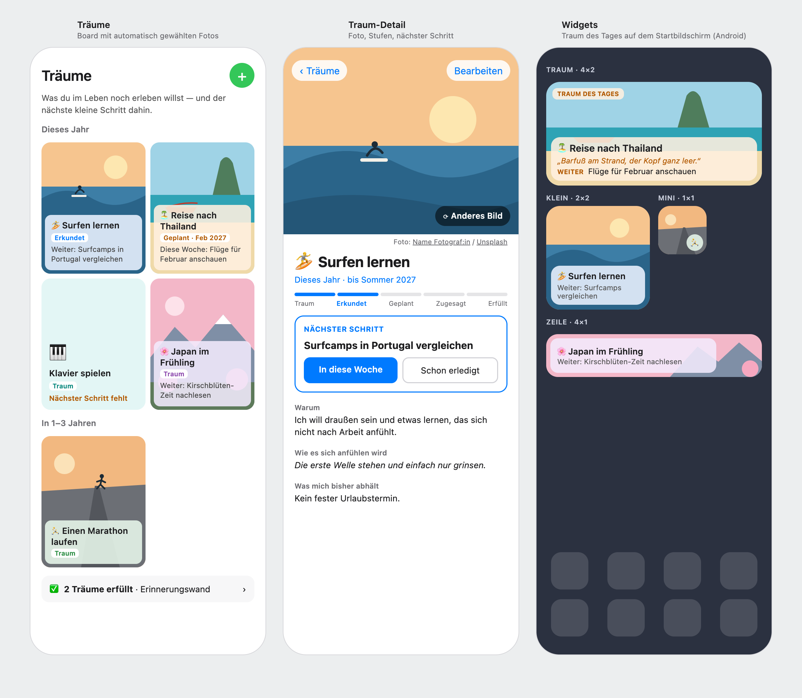

# LifeDirector

**A growth app, not just a habit tracker.** LifeDirector helps you keep your everyday habits on track, regularly pushes you a little outside your comfort zone, and keeps your big life dreams in view until you take the next small step. It works on four time horizons:

- **Daily: habits.** Things you want to do regularly. That can be every day ("Wasser am Morgen") or a few times a week ("Gym, 3× pro Woche"). Hitting your own target counts as success, so you don't need a perfect 7/7.
- **Weekly: tasks.** One-off things for this week, each tagged with a category (physical, creative, social, hands-on) or linked to a dream.
- **Monthly: challenges and goals.** Each month the app suggests a category, and you draw a random challenge from it ("Töpfer-Workshop", "Cold Approach"). You can also set free-form monthly goals ("Umzug organisieren").
- **Long-term: dreams.** A mix of vision board and bucket list ("Surfen lernen", "Reise nach Thailand"). Each dream gets a matching photo automatically, moves through stages (Traum → Erkundet → Geplant → Fest zugesagt → Erfüllt) and always has one small next step that you can turn into a weekly task. Fulfilled dreams land on a memory wall.

The app rewards progress instead of demanding perfection. One missed day doesn't wipe out your progress, because a soft *momentum* score carries you through. Milestones, reached weekly targets, completed challenges and dream steps are celebrated with confetti and a short message about who you're becoming, rather than a generic "good job". Reminder notifications encourage you instead of nagging you.

There's no sign-up. You open the app and start right away, and you can secure your account with your email later.

The app interface is in German.

## What it looks like




*Mockups with sample data. In the app, the dream photos are real Unsplash photos; here they are drawn placeholders. The sources are [`docs/mockup.html`](docs/mockup.html) and [`docs/mockup-dreams.html`](docs/mockup-dreams.html), and the command to re-render each image is in its header comment.*

| Screen | What you do there |
|---|---|
| **Today** | Tick off today's habits, see your active challenge, this week's tasks and the *dream of the week* with its next step. Weekly-target habits show their progress ("2/3 diese Woche") and streaks are counted in days or weeks. The gear icon opens the settings. |
| **Habits** | Add, reorder and remove habits, and set each one to *Täglich* or 1–6× per week. |
| **Challenges** | Draw a challenge from this month's category, track its status (open → active → done) and manage monthly goals. |
| **Träume** | Your dreams as a photo board, grouped by horizon (this year, 1–3 years, 5+ years, someday). The detail screen has the why, the feeling, the obstacle, the stages and the next step. "Anderes Bild" swaps the photo. |
| **Review** | See the last 7 days, measured against your own targets. It includes a per-habit and per-weekday breakdown, an optimization hint and a list of every challenge you've completed. |
| **Settings** | Secure your account with an email code, sign in on another device, sign out, or delete all your data. |
| **Widgets** (Android) | A dream on your home screen in four sizes, either a different dream every day or one fixed dream. Tapping it opens the dream. |

Where the app is heading (a calmer Today screen with weekly priorities, focus weeks, shared challenges with a friend, more) is in [ROADMAP.md](ROADMAP.md).

---

## Tech stack

- [Expo](https://docs.expo.dev/versions/v57.0.0/) SDK 57 with React Native and Expo Router (tabs in `app/(tabs)/`)
- [Supabase](https://supabase.com) for data (Postgres with row-level security), anonymous auth with optional email sign-in, and an Edge Function for the dream photos
- [Claude](https://www.anthropic.com) (Haiku 5.5) and the [Unsplash API](https://unsplash.com/developers) for picking dream photos, called only from the Edge Function
- `react-native-android-widget` for the home screen widgets, `expo-updates` (EAS Update) for shipping JavaScript changes without a new build
- `react-native-reanimated` for the celebration animation, `expo-notifications` for the daily reminder

| Path | Contents |
|---|---|
| `app/` | Screens: `(tabs)/index.tsx` (Today), `habits.tsx`, `challenges.tsx`, `dreams.tsx`, `review.tsx`; `dream/` (new dream, detail, memory wall); `settings.tsx`. `_layout.tsx` creates or restores the session before showing any screen |
| `lib/` | Supabase client and session (`supabase.ts`), account handling (`account.ts`), streak, momentum and motivational texts (`motivation.ts`), habit, challenge and dream logic, dream photos (`dream-image.ts`), week and month keys, notifications, widget bridge |
| `widgets/` | Home screen widget layouts, data loading and the on-device photo cache (Android only) |
| `components/` | Celebration overlay, dream form, keyboard handling |
| `constants/theme.ts` | Shared colors |
| `types/` | Row types for the Supabase tables |
| `supabase/` | SQL schema and migrations; `functions/dream-image/` is the Edge Function for dream photos |
| `docs/` | Mockups (HTML sources and rendered PNGs) |

## Requirements

- Node.js 20.19.x or newer
- A Supabase project
- Expo Go, a development build, or an Android/iOS environment. Notifications and widgets need a development build or an installed APK, because Expo Go doesn't support them. The rest of the app runs in Expo Go.

## Supabase setup

The app connects to the project configured in `lib/supabase.ts`. To use your own project, replace the URL and anon key there with the values from **Supabase Dashboard → Project Settings → API**. Never put a `service_role` key or any other secret in the app.

1. **Authentication → Sign In / Providers:** enable **Allow anonymous sign-ins**. Every install silently gets its own anonymous account on first launch, so there's no login screen.
2. **Authentication → Email** (for "Konto sichern"): set the email OTP length to **6**, and use `{{ .Token }}` in the "Magic Link" and "Change Email Address" templates, because the app expects a 6-digit code. Configure an SMTP provider for sending the codes.
3. **SQL Editor:** run these files in order:
   1. `supabase/schema.sql`: habits, logs, challenges, challenge progress
   2. `supabase/challenges.sql`: the starter challenge catalog (safe to re-run)
   3. `supabase/tasks_and_goals.sql`: weekly tasks and monthly goals
   4. `supabase/habit_frequency.sql`: weekly target per habit
   5. `supabase/auth_1_user_columns.sql`: adds an owner (`user_id`) to every personal row, plus per-user RLS policies
   6. `supabase/auth_2_claim_and_lock.sql`: assigns existing rows to the first account and removes the prototype access that needed no login. On a fresh project with no data yet, open the app once first so an account exists.
   7. `supabase/delete_account.sql`: lets a user delete their own account and data
   8. `supabase/dreams.sql`: dreams, dream steps and the link between weekly tasks and dreams
   9. `supabase/dream_images.sql` and `supabase/dream_images_2_attempted.sql`: photo columns on dreams and the daily limit for photo searches
4. **Edge Functions → Secrets:** add `ANTHROPIC_API_KEY` (from the [Claude Console](https://console.anthropic.com), with a spending limit) and `UNSPLASH_ACCESS_KEY` (the Access Key of an Unsplash app).
5. **Edge Functions:** deploy `supabase/functions/dream-image/index.ts` as a function named `dream-image`, either by pasting it into the dashboard editor or with `supabase functions deploy dream-image`. The file is self-contained.

These files bootstrap a fresh project and use `if not exists` where possible. If your tables already exist, compare them against these files before re-running anything.

### Accounts and data ownership

Each user only sees and changes their own habits, logs, tasks, goals, challenge progress and dreams. The challenge catalog is shared by everyone.

Accounts start **anonymous and tied to the install**. Securing the account with an email code in the settings keeps the same account, protects it against uninstalling or switching phones, and lets you sign in on another device. An unsecured account is lost when the app is uninstalled. `supabase/auth_3_move_data_to_new_account.sql` moves all data from one account to another as a manual fallback.

### Dream photos

When a dream is created, the app calls the `dream-image` Edge Function. Claude turns the dream into three English photo search queries, Unsplash returns up to six photos, and Claude ranks them by how well they fit the dream. The best one is shown with the photographer credit Unsplash requires; "Anderes Bild" moves to the next candidate without another AI call. Each user can trigger at most 4 AI calls per day, and each dream is searched once. Editing a dream's title keeps its photo. If nothing fits, the dream keeps its emoji and color.

## Run the app

```bash
npm install
npm run start     # then open in Expo Go, a simulator or a development build
npm run lint      # ESLint
npx tsc --noEmit  # type check
```

`npx expo install` currently fails with an npm `EALLOWSCRIPTS` error in this project. Install Expo packages with `npm install <package>@~<SDK version>` instead.

Build an installable Android APK with EAS:

```bash
npx eas-cli build --platform android --profile preview
```

To update an installed APK, install the new one over it without uninstalling first. Your data lives in Supabase, and the session stays on the device.

Changes that only touch JavaScript can reach an installed build without a new APK, through EAS Update:

```bash
npx eas-cli update --channel preview --platform android --message "Short description" --environment preview
```

Close and reopen the app up to twice to apply it. `--platform android` is required, because the web export fails. A new build is still needed after adding a native module or changing plugins in `app.json`; the update then simply doesn't reach older builds.
